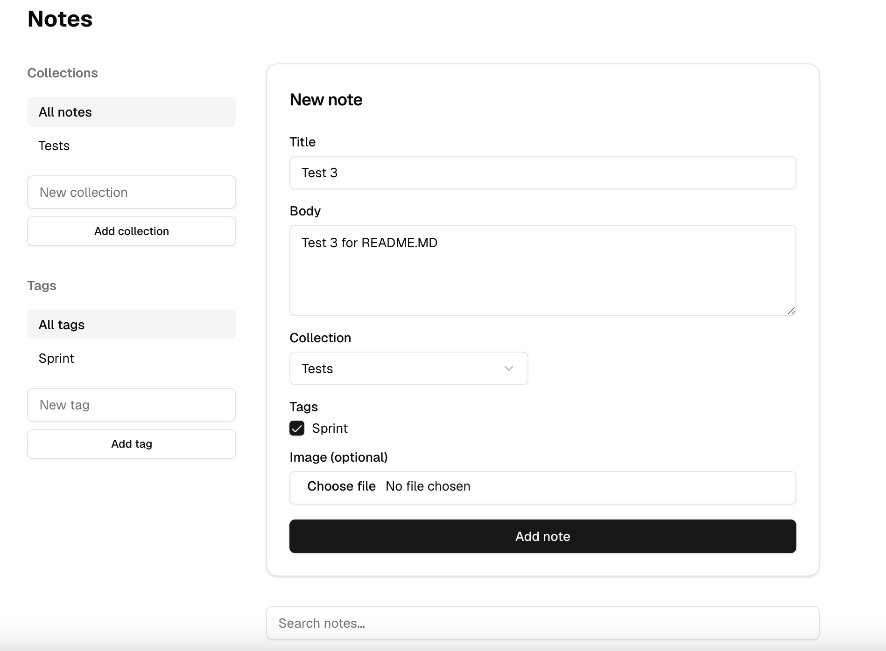

# Notes App

A private, per-user notes app built with Next.js and Supabase — a course
project for Turing College's "Building with AI Agents." Every signed-in
user gets their own private workspace: notes, collections, and tags are
scoped to the account that created them and are never visible to anyone
else. See `CLAUDE.md` for the full architecture and conventions, and
`REFLECTION.md` for the reasoning behind key decisions.

## Features

- Email/password sign-up and sign-in via Supabase Auth (Google OAuth also
  supported)
- Full CRUD on notes: create, edit, delete, all persisted in Supabase
- Notes can be organized into collections and tagged; filter by either
- Server-side full-text search across note title/body
- A collection can be shared via a public, read-only link
- Notes can have one attached image, stored in Supabase Storage
- Every route under `/protected` requires a signed-in user, verified on
  the server before the page ever renders — not just hidden in the
  browser

## Screenshot



## Running locally

1. Clone this repo and install dependencies:

   ```bash
   npm install
   ```

2. Create a Supabase project at [supabase.com](https://supabase.com) if
   you don't already have one for this project.

3. Copy your project's URL and publishable/anon key into a `.env.local`
   file at the project root:

   ```
   NEXT_PUBLIC_SUPABASE_URL=your-project-url
   NEXT_PUBLIC_SUPABASE_PUBLISHABLE_KEY=your-publishable-or-anon-key
   ```

   Find both values in the Supabase Dashboard under **Settings → API**
   for your project. Never commit `.env.local` — it's already gitignored.

4. Set up the schema — the tables (`notes`, `collections`, `tags`,
   `note_tags`), RLS policies, indexes, and the `note-images` Storage
   bucket + policies were all built by hand in the Supabase Dashboard
   (Table Editor / SQL Editor), not via a migration file. See
   `CLAUDE.md`'s "Data model" and "Image uploads" sections for the exact
   schema and the SQL used to build it.

5. Start the dev server:

   ```bash
   npm run dev
   ```

   The app runs at [http://localhost:3000](http://localhost:3000).

6. Sign up for an account (or create one directly in the Supabase
   Dashboard's **Authentication** tab), sign in, and you'll land on
   `/protected/notes`.

## Optional task

**Image uploads via Supabase Storage** (Hard tier) — delivered on its own
branch, [`feature/image-uploads`](https://github.com/kentonmcr/supabase-midsprint/tree/feature/image-uploads),
and merged via [PR #3](https://github.com/kentonmcr/supabase-midsprint/pull/3).
A note can have one attached image, stored in a private Storage bucket
(never a public bucket, never base64 in the database) and scoped per-user
via Storage RLS policies — see `CLAUDE.md`'s "Image uploads" section and
`REFLECTION.md` for full detail, including issues found and fixed during
a fresh-session code review of that PR before merging.
